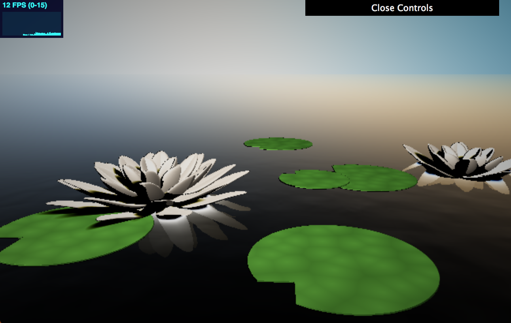
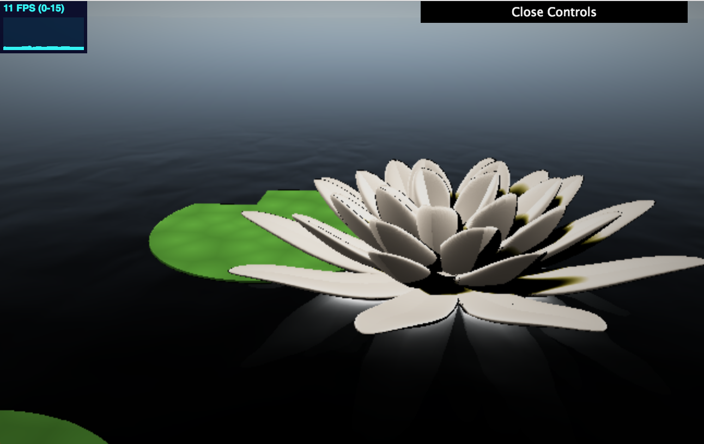
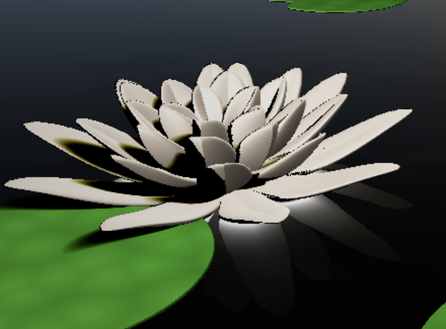
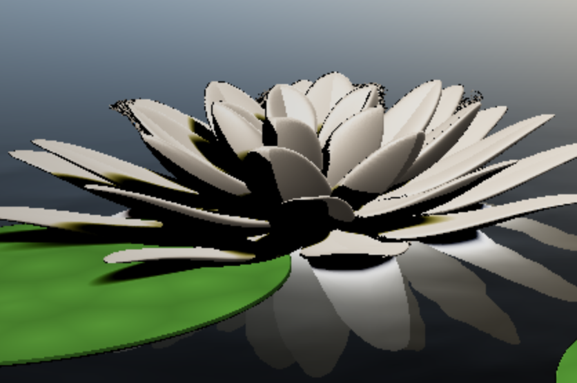

# Environment Setpiece

### Chloe Le
- https://chloele.com/

### Demo: 
- http://www.chloele.com/environment-waterlilies/

 

 

## References

For SDF functions, SDF normal calculations, soft shadows, I referenced Inigo Quilez:
http://www.iquilezles.org/www/articles/distfunctions/distfunctions.htm
http://iquilezles.org/www/articles/normalsSDF/normalsSDF.htm
http://iquilezles.org/www/articles/rmshadows/rmshadows.htm

For ray casting and ray marching, I referenced [slides](https://docs.google.com/presentation/d/e/2PACX-1vSN5ntJISgdOXOSNyoHimSVKblnPnL-Nywd6aRPI-XPucX9CeqzIEGTjFTwvmjYUgCglTqgvyP1CpxZ/pub?start=false&loop=false&delayms=60000&slide=id.g27215b64c6_0_107
) from UPenn's CIS460/560 course.

For one single layer of petal, I referenced https://www.shadertoy.com/view/4sKBW3

## Inspiration
I love Claude Monet's Water Lilies paintings, so I centered around water lilies for this project.

Below are some images that were helpful to me: 
 

## Features Implemented
- Animation of environment elements
- Three different uses of noise (FBM, FBM3d, Worley)
- Remapping of colors (contrast and saturation)
- Smoothstep toolbox function
- Approximated environmental lighting 
- SDF-based soft shadows
- Approximation of water activity based on distance
- Reflectivity of water
- Approximated Fresnel reflectivity (more reflectivity at glancing angles)
- Vignette
- SDF blending
- Distance fog

## Implementation

### Scene Geometry
The lilies and leaves are composed of SDFs such as sphere, cylinders, and cubes. 

One lily is made from layers of re-shaped sphere sdfs. To get one layer of the petals, I first get the angle and radius of the point in question, then I divide it up to get repeated petals. Next, I make the x and z direction of each division pointy by applying the absolute value of the previous division. Then, I apply a curl to the xy direction, and finally, flatten the y direction and feed the pos vec3 to the sphereSDF. 

Each lily leaf is made from one flattened cube and one flattened cylinder, to give each some height. I used displacement of the cube and the subtraction operation to get the missing corner of each leave.   

### Noise Functions

FBM and Worley noise are used in this scene. Worley noise is applied to the texture of the leaves, fbm is used on creating a bump map for the water's normals, and create the glow of the sky.

### Animation
In the scene, the water lilies and one of the leaves is animated using sin functions combined with u_Time. For the water lilies, I am changing the curl of the petals, and for the leaf, I am simply displacing it in the x and z directions. The water movement is also animated using u_Time applied to the fbm function.

### Water
To create the water, we first perform an intersection test against a plane with normal (0, 1, 0) and located at the y=0 position. 

If the ray hits water, we calculate the water normal, which is a normal offset based on distance, so that the farther away, the less noisy the water would be. The bump offset utilizes smoothstep function, and then the fbm noise is applied to xz direction. My fbm function takes into account u_Time, to animate the water movement.

For the reflection of the water, I run a test against our scene geometry, especially the lilies since they have a significant height, to see if the ray would hit. If we hit the water and the reflected ray would hit the lilies, then that would mean the water at this point must have reflection. We accumulate a lighter color that fits the scene and take into account the distance to the final color term. 

Next, I mix the final color term with the skybackground's color and a Fresnel term. This gets us reflectivity that is dependent on the angle. See below:

 

 

### Vignette, Saturation, and Contrast

Vignette is done while taking into account the dimension of the window, the uv, and the fall off term. We find the coord, take the square root of the coord's dot product, square that term, and finally take the inverse to get the effect color, which I add to the output.

For contrast, we take the square of the color and multiply that with an adjustable term that subtracts c*color from a float.

For saturation, I mix the color with the dot product of the color and vec3(0.4), which adds luminance to the RGB values.

### Shading with Surface Normal Computation
Surface normal computation of the SDF is done by using the forward and central differences technique. 
This technique uses an offset in the positions directional components and normalize all components. 
The lighting/shading of the surfaces uses a mix of ambient, diffuse, and soft shadow. We pass in the light direction, color, the point, and ray direction to compute the corresponding light from the three. 

### Distance Fog
The fog term utilizes smoothstep of two floats with the length of our fs_Pos, and then it is clamped between 0 and 1.
  
In my final color output, I mix in a white-ish color with fhe fog term to create the distance fog effect.

## Future Improvements
If time allows, I would do the following to improve my work
 - simulate the translucent characteristic of the petals.
 - simulate the leathery quality of the leaves
 - submerge some leaves 
 - add water droplets
 - add color to the center of the lilies
 - bend/curl the leaves
 
